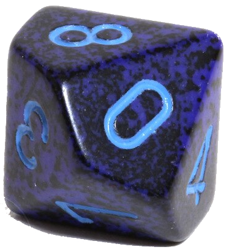
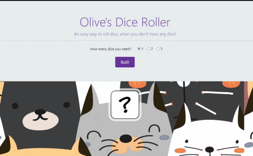

# Dice Roller

Table of content

-  [Summary](#summary)
-  [Technologies](#technologies)
-  [Updates](#updates)
-  [Status](#status)
-  [License](#license)
-  [Live Site](#live-site)

## Summary

**Generates random dice rolls for 1-3 dice** 
Built for my daughter to use in her maths class during remote learning, during Covid 19 lockdown. 
My first project from scratch that is not part of a course! It works!

## Technologies

 

Built using Bootstrap and jQuery

---

---

## Updates

-  Improved mobile layout
-  Added option to choose d10 dice (10 faces) 

## Status

## License

 
This project is licensed under the terms of the BSD 3-clause "New" or "Revised" license. 

## Live Site

 
This project is [deployed with Netlify](https://olives-dice-roller.netlify.app/)
